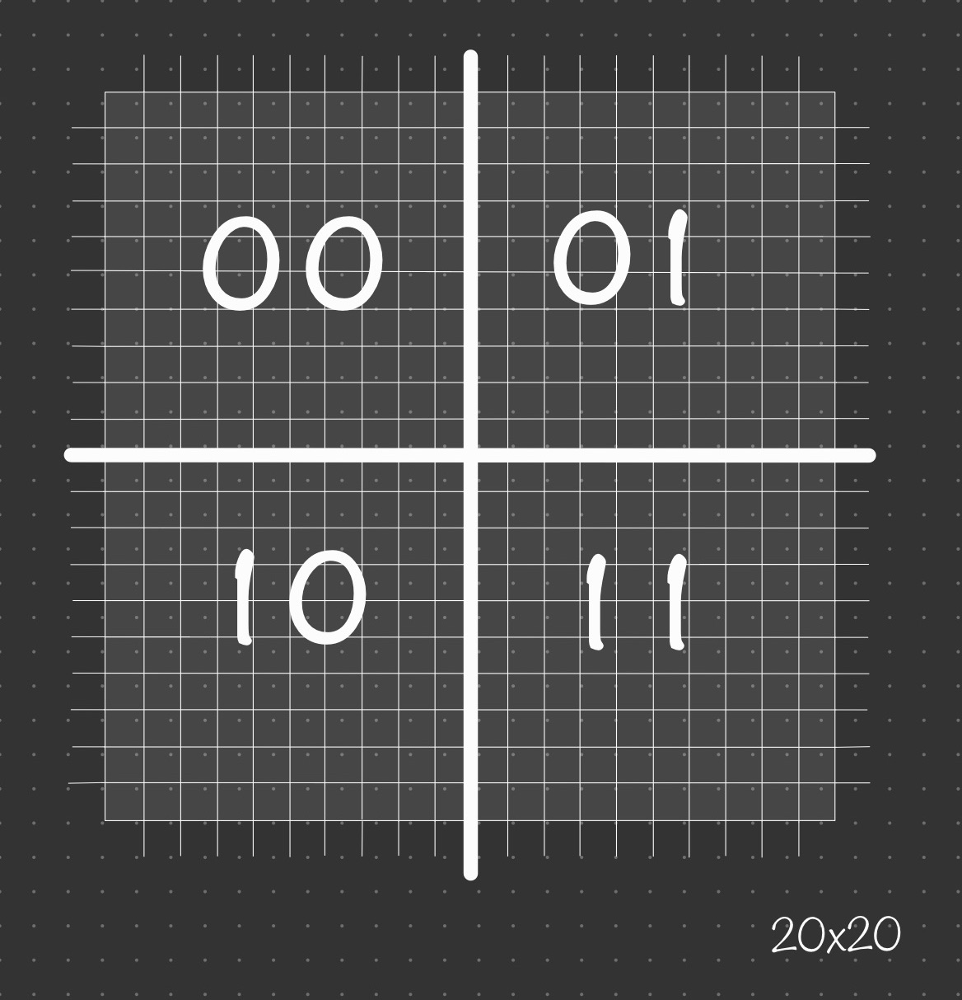

# Mapa

El mapa consiste en un tablero de 20x20 que va a estar fornada por cuatro cuadrantes en las que cada una de ellas estará representando una ciudad

# Ciudad

Cada ciudad estrá formada por un tablero de 10x10 en las que se almacena:
- Nombre
- Temperatura
- Posiciones Minas
- Posiciones Alimentos
- Posiciones Jugadores
- Posiciones NPC's

# Steps:

1.  Install [docker](https://www.docker.com/products/docker-desktop/)
2.  Install [offset explorer 2](https://www.kafkatool.com/download.html)
3.  Install [mongoDB compass](https://www.mongodb.com/try/download/compass), [mongosh](https://www.mongodb.com/docs/mongodb-shell/install/) 
    and [mongodb-community](https://www.mongodb.com/docs/manual/administration/install-community/)
4.  Run docker-compose up -d
5.  Test

## Test Kafka

1.  Run docker-compose up -d
2.  Open Offset Explorer
3.  Run kafka_producer.py
4.  Run kafka_consumer.py

## Test AA_Registry-AA_Player

1. Open MongoDB Compass 
2. Start mongodb service (if neccesary):
    - MACOS: brew services start mongodb-community
    - Linux: sudo service mongodb start
4. Run AA_Registry.py
5. Run AA_Player.py
